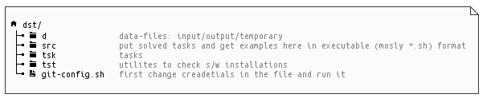

# Data Storage Technologies Course Artifacts Repository

## Directory Structure

## The Workflow

1. Configure Git DVCS

    - 1.1. Edit `git-config.sh`: set your credentials.

    - 1.2. Run `git-config.sh`

2. Get tasks from `tsk`.
3. Search for input data in `d`, and use the directory to save output and temporary data.
4. Watch examples from the classes at `src`.
5. Solve tasks, save solutions to `src` as `*.sh`-files.
