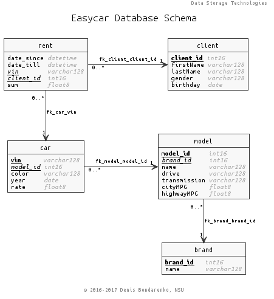

# Task List 2. Relational DBMS

## Inputs

1. All input files are located at the data directory `~/dst/d/` this is the default data directory
2. The result format:

  - all tasks are made with `*.sh`-scripts inside `~/dst/src/` directory;
  - for the tasks list a folder is created, according to a task list id
 (ex: this task list id is 1, so there should be the corresponding folder `~/dst/src/1`)
  and all solutions should be placed in it.
  - The solutions should be named according to the task number. Ex: `1.1.1.sh`

## 1. Level 1: All tasks should be accomplished

2.1. Work with database "easycar". This is a simple CRM/ERP for a car rental company. The database schema looks like this:
.

Tasks are to be accomplished in the order they appear.

2.1.1. Create table `car` with columns: `vin`, `model_id`, `color`, `year`, `rate`.

2.1.2. Convert data from `easycar-clients.csv` to `sql` format and save it to `easycar-clients.sql`.

2.1.3. Use `psql` to connect to PostreSQL server with user `postgres`.

2.1.4. Create user `easycar` with password `easycar`.

2.1.5. Create database `easycar`.

2.1.6. Grant all privileges on database `easycar` to the user `easycar`.

2.1.7. Connect to database `easycar` using `psql` and create table `client` according data in `easycar-clients.sql`. Let `client_id` be automatically incremented on adding new record.

2.1.8. Execute sql-script `easycar-clients.sql` using `psql`.

2.1.9. Execute sql-script `easycar-data-except-clients.sql` using `psql`.

2.1.10. Remove duplicate clients. assume, that a client is unambiguously identified by his birthday and the first and second names.

2.1.11. Create a foreign key between tables `car` and `model` to provide better consistency.

## 2. Level 2: One of the tasks should be accomplished

2.2.1. do the 2.1.10, but keep all easycar rents consistent. Create `procedure` for it

2.2.2. create a clerk tool, including:
  - create a `view` that lists all vacant cars
  - create a `function` that returns a car status - is it vacant or how long it is left to the end of a rent interval depending on date input
  - create a `function` that returns a cost of rent for a car VIN and date interval set

2.2.3. create a relational db from the file `books.csv`, set constraints and fill the db with data. create query that lists top 10 authors.
> The file `book.csv` uses open data from  &copy;	[2009 - 2017 Usable Databases. DataStellar Co., Ltd.](http://www.usabledatabases.com/database/books-isbn-covers/sample/#table_book)

2.2.4 tree traversal procedure

---
&copy; 2016-2017 Denis Bondarenko, NSU.
